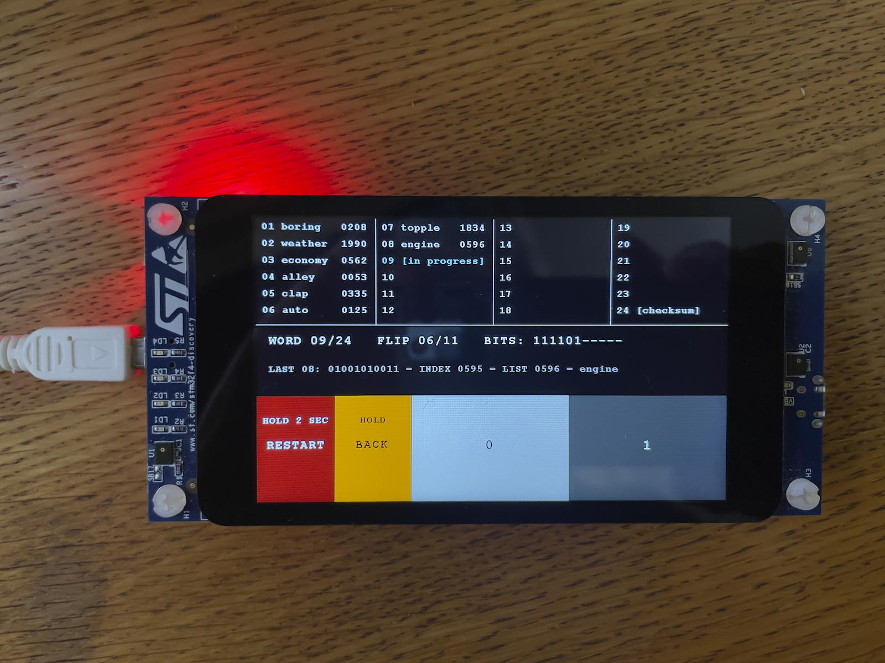

# Coinflip BIP-39

Coinflip is a transparent, air-gapped tool for generating a 24 word BIP39
mnemonic from coin flips. It runs on the **STM32F469I Discovery** development
board (`STM32F469I-DISCO`), using its integrated 800 x 480 touchscreen.



The user can independently verify each generated
word. For every completed word, the display shows:

- the 11-bit binary value;
- the corresponding zero-based decimal index;
- the one-based position in the BIP-39 English word list and
- the resulting BIP39 word.

These values can be checked against an independent copy of the BIP39
English word list. The first entry in a printed list is position 1, while its
zero-based index is 0.

The tool can operate air-gapped by powering the board from a USB wall power
adaptor rather than a computer. It does not require a network connection and
does not transmit the generated mnemonic.

## How it works

The user enters 256 coin flips using the `0` and `1` touchscreen buttons. The
first 253 flips directly produce the first 23 words. The remaining three flips
complete the entropy, after which the tool calculates the BIP39 checksum and
derives word 24.

The final verification line separates the three coin-flip entropy bits from
the eight checksum bits with a vertical bar:

```text
LAST 24: 000|01100110 = INDEX 0102 = LIST 0103 = art
```

## Controls

- `0` and `1` record one coin flip per touch.
- `BACK` requires a short hold and removes the latest bit. It can move backward
  across ordinary word boundaries.
- `RESTART` requires a two-second hold and securely clears the current entry.
- Once all 24 words are complete, the phrase is locked and only `RESTART`
  remains available.

All 24 words remain visible until the board is powered off or the sequence is
restarted.

## Building and testing

The firmware targets the STM32F469I Discovery board and uses the STM32CubeF4
HAL and board-support libraries.

Build the firmware:

```sh
make
```

Run the host-side SHA-256, state-machine, and BIP39 vector tests:

```sh
make test
```

Program the board through its onboard ST-LINK connector:

```sh
make flash
```
## Security notes

- Verify the displayed values against a trusted, independent BIP39 list.
- For air-gapped operation, power the board from a 5V USB power adaptor.
- The seed phrase isn't stored on the device and disappears when power is removed.

  
